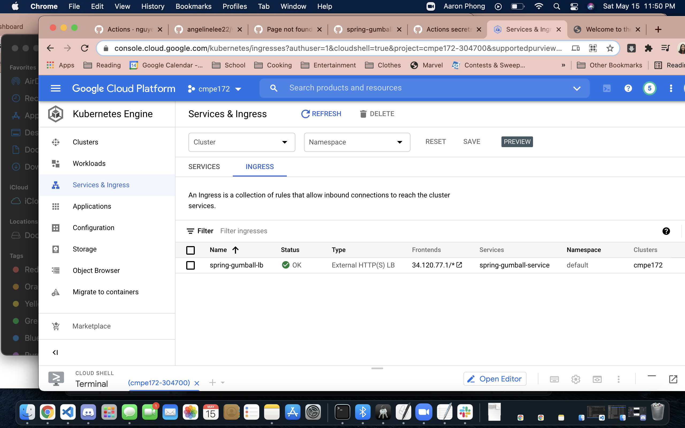

# CMPE 172 - Lab #10 Notes

NOTE: The device used in this lab was under the name of "Aaron Phong" because I had technical difficulties with my own device.

## CI Workflow (Part 1)
1. Commit build.yml to `master` branch

2. Watch for build success

### CD Workflow (Part 2)
1. Create service account as "owner"

2. Create service account key

3. Create GitHub action secrets

4. Update google.yml to contain GKE deployment information and trigger CD Deployment with release

5. Wait for workflow success (here it was done under 1.1)

All workflows afterwards:

**Google Kubernetes Engine Results**

6. Cluster creation (manual)

7. Deployment

8. Service

9. Ingress

10. Success!

